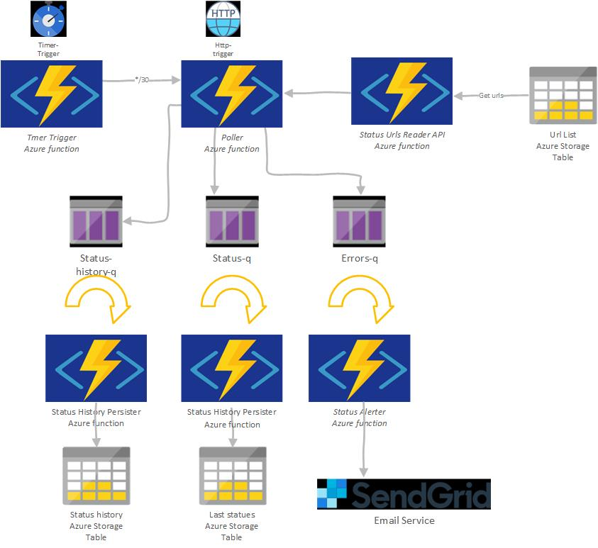

# Legacy Azure Functions (C# Script / .csx)

This folder preserves the original portal-authored C# script functions for
reference. They have been ported to a compiled .NET 8 isolated-worker project
in [`src/`](../src/) — see the table below for where each one went.

| Legacy function | Trigger | Ported to |
| --- | --- | --- |
| `pollerTrigger` | Timer (hourly) | `PollSchedulerFunction` (per-tenant, per-plan schedule) |
| `statusPoller_http` | HTTP | `UrlPollerFunction` + `UrlPollerService` (queue-driven fan-out) |
| `statusQueuePersister` | Queue | `StatusStatePersisterFunction` |
| `statusHistoryQueuePersister` | Queue | `StatusHistoryPersisterFunction` |
| `urlPersister` | HTTP | `UrlApiFunctions.ImportUrls` / `DeleteUrl` |
| `urlQueuePersister` | Queue | `UrlImportPersisterFunction` |
| `statusUrlListReader` | HTTP | `UrlApiFunctions.ListUrls` |
| `statusSiteStateReader` | HTTP | `StatusApiFunctions.GetCurrentStatuses` |
| `statusHistoryReader` | HTTP | `StatusApiFunctions.GetUrlHistory` |
| `emailAlerter_csharp` | Queue | `EmailAlerterFunction` |

## Original logical architecture

These files are no longer deployed. Do not modify them; make changes in the
new projects instead.
